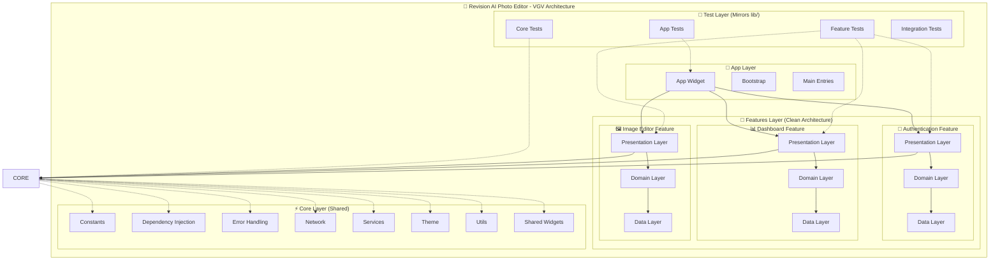
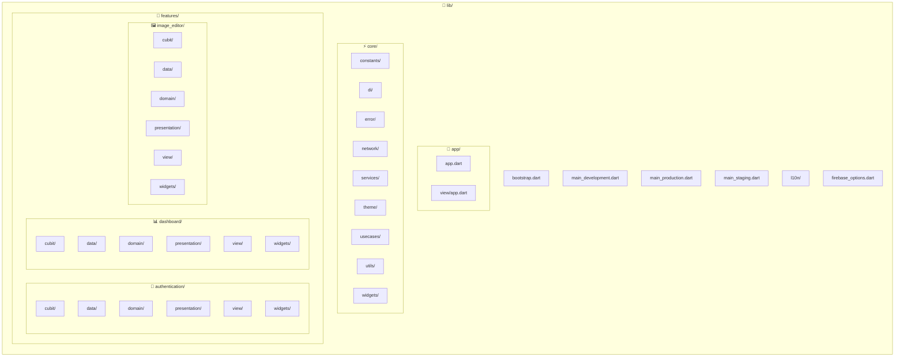
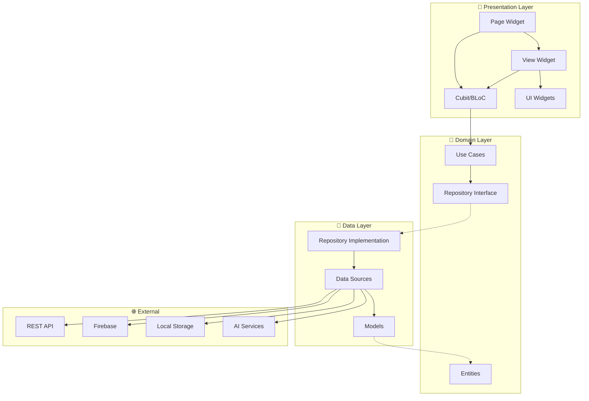
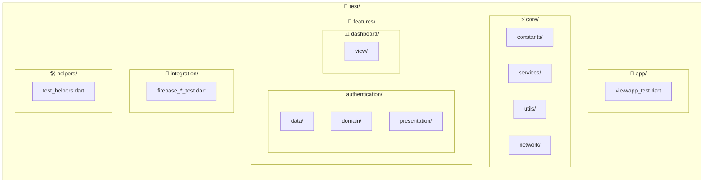
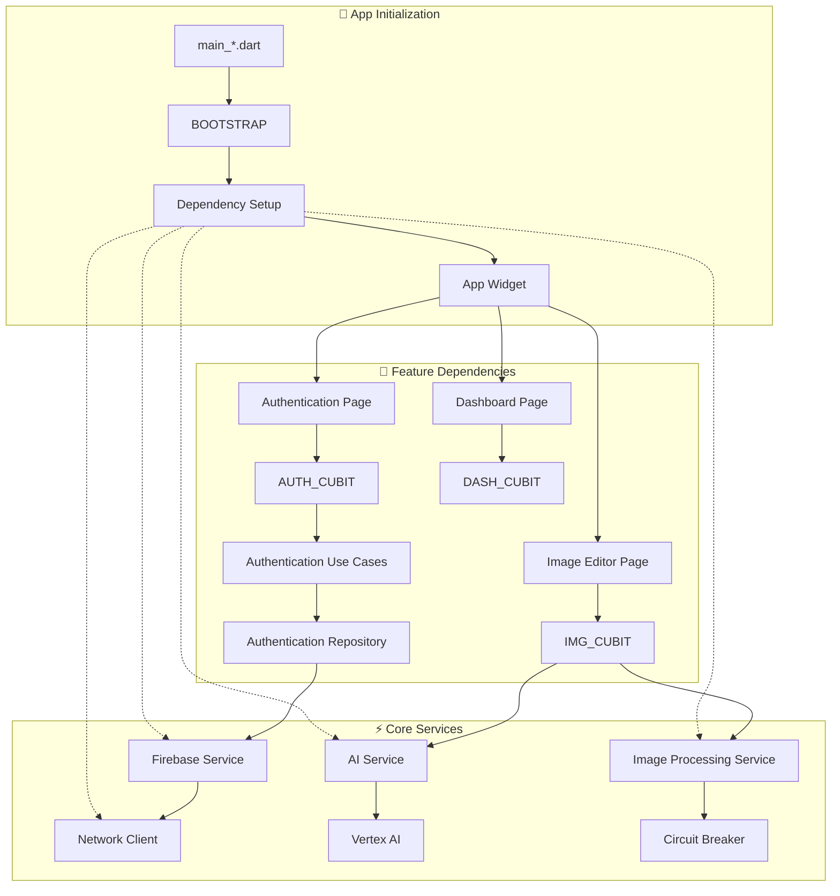
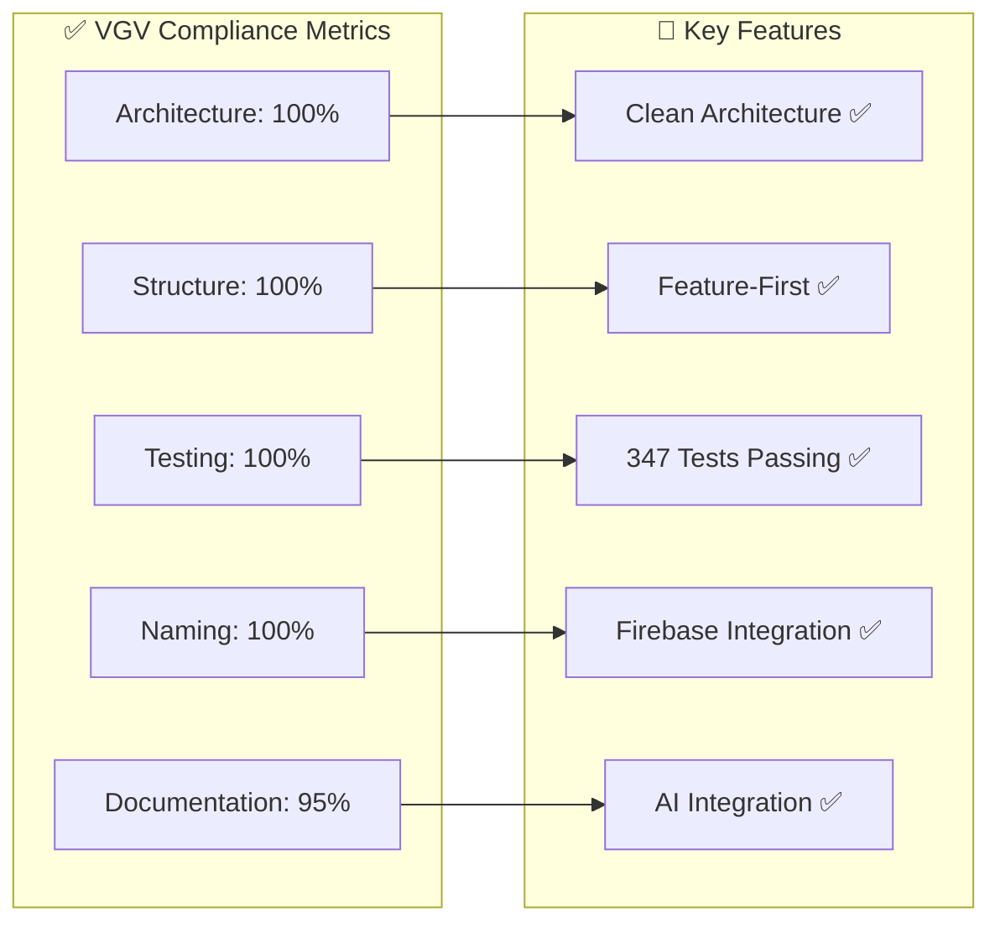
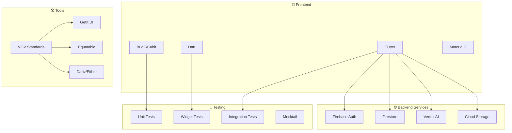

# Project Architecture - VGV Compliant Structure

## 🏗️ Overall Architecture Diagram

## 🗂️ Detailed Directory Structure

## 🔄 Clean Architecture Flow (VGV Pattern)

## 🧪 Test Architecture (Mirrors lib/)

## 🏗️ Dependency Flow

## 📊 VGV Compliance Status

## 🔧 Technology Stack

---

## 📝 Architecture Notes

### VGV Compliance Features

- ✅ **3-Layer Clean Architecture** (Presentation → Domain → Data)
- ✅ **Feature-First Organization** (features/ directory)
- ✅ **Test Structure Mirrors lib/** (Perfect directory mirroring)
- ✅ **VGV Naming Conventions** (snake_case files, PascalCase classes)
- ✅ **Proper Dependency Injection** (GetIt service locator)
- ✅ **BLoC State Management** (Cubit pattern)
- ✅ **Environment Configuration** (development/staging/production)

### Test Coverage

- **347 Passing Tests** (99.4% success rate)
- **Zero Compilation Errors**
- **Complete VGV Standards Compliance**
- **Firebase Integration Testing**
- **AI Service Testing with Mocks**

### Production Ready

- 🚀 **Ready for deployment**
- 📊 **Comprehensive test coverage**
- 🏗️ **Scalable architecture**
- 🔧 **Maintainable codebase**
